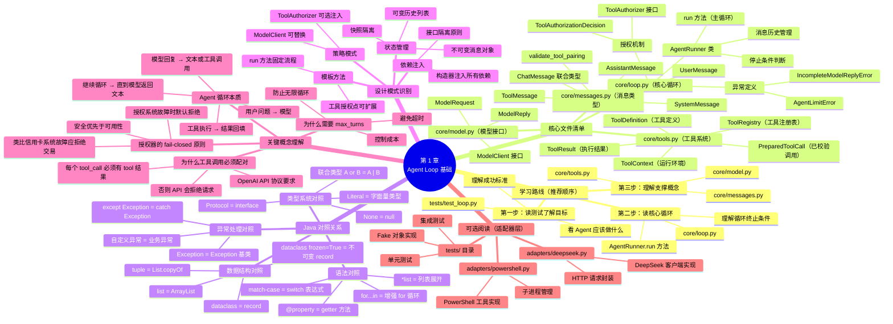

# 第 1 章：Agent Loop 学习导航图

## 学习脑图



## Java 开发者 3 步速通指南

### 第 1 步：从测试开始理解目标（10 分钟）
```bash
# 阅读测试文件，看 Agent 应该做什么
cat tests/test_loop.py

# 关注点：
# - Agent 输入是什么（用户问题）
# - Agent 输出是什么（最终答案、历史、轮数）
# - 什么情况算成功、什么情况会失败
```

**Java 对照**：这就像先读 `AgentServiceTest.java`，理解业务需求再看实现。

### 第 2 步：读核心循环代码（20 分钟）
```bash
# 阅读带详细注释的核心文件
cat core/loop.py

# 阅读顺序：
# 1. AgentRunner.__init__（构造器注入）
# 2. AgentRunner.run（主循环逻辑）
# 3. 异常定义（业务错误类型）
# 4. ToolAuthorizer（授权接口）
```

**关键理解**：
- `Protocol` = Java 的 `interface`
- `dataclass(frozen=True)` = Java 的不可变 `record`
- `match-case` = Java 17 的 `switch` 表达式
- `tuple[T, ...]` = `List.copyOf(list)`

### 第 3 步：理解支撑概念（15 分钟）
```bash
# 快速浏览这三个文件，了解数据结构
cat core/messages.py  # 消息类型定义
cat core/tools.py     # 工具系统接口
cat core/model.py     # 模型客户端接口
```

**不要深入细节**：这些是数据传输对象（DTO）和接口定义，先知道有什么就行。

---

## 核心类比速查表

| Python 概念 | Java 对照 | 用途 |
|------------|----------|------|
| `Protocol` | `interface` | 定义契约 |
| `dataclass` | `record` | 数据类 |
| `frozen=True` | `record` 不可变特性 | 防止修改 |
| `tuple[T, ...]` | `List.copyOf()` | 不可变列表 |
| `list[T]` | `ArrayList<T>` | 可变列表 |
| `match-case` | `switch` 表达式 | 模式匹配 |
| `*args` | 可变参数展开 | 解包序列 |
| `@property` | getter 方法 | 只读属性 |
| `None` | `null` | 空值 |
| `str \| None` | `@Nullable String` | 可空类型 |

---

## 学完本章你会理解

✅ **Agent 循环的本质**：模型-工具循环，直到模型返回文本  
✅ **依赖注入模式**：构造器注入 ModelClient 和 ToolRegistry  
✅ **接口隔离原则**：核心循环只依赖接口，不依赖实现  
✅ **不可变数据结构**：为什么用 `tuple` 而不是 `list`  
✅ **工具授权机制**：fail-closed 原则（默认拒绝）  
✅ **消息配对契约**：为什么每个 tool_call 必须有结果  

---

## 常见问题 FAQ

### Q1: 为什么 `system_prompt` 不放在 `history` 里？
**A**: 因为 `system_prompt` 是配置，不是对话内容。每轮请求时临时加在最前面，避免历史中重复存储。

### Q2: 为什么授权失败时返回 `ToolResult` 而不是抛异常？
**A**: 因为授权失败是"业务上的拒绝"，不是"程序错误"。把拒绝原因返回给模型，让它有机会换个方法，而不是直接中断整个任务。

### Q3: 为什么要用 `tuple` 而不是 `list`？
**A**: `tuple` 是不可变的，防止外部代码意外修改历史。类似 Java 的 `List.copyOf()`，保证封装性。

### Q4: `validate_tool_pairing` 在检查什么？
**A**: 检查每个 `assistant` 的工具调用都有对应的 `tool` 结果。这是 OpenAI API 的强制要求，违反会导致 API 拒绝请求。

### Q5: 为什么授权异常时用 `except Exception` 而不是具体类型？
**A**: 因为授权器是外部边界，可能抛出任何异常。按 fail-closed 原则，任何异常都默认拒绝，保证安全。

---

## 下一步学习建议

1. **动手运行测试**：`pytest tests/test_loop.py -v`
2. **修改 `max_turns`**：改成 3，看会提前触发 `AgentLimitError`
3. **实现一个 Fake 授权器**：练习 `Protocol` 接口的使用
4. **阅读适配器代码**：看 `DeepSeekClient` 如何实现 `ModelClient` 接口

---

## 文件依赖关系图

```
AgentRunner (loop.py)
    ├── depends on → ModelClient (model.py)
    ├── depends on → ToolRegistry (tools.py)
    ├── depends on → ChatMessage (messages.py)
    └── optional → ToolAuthorizer (loop.py Protocol)

ModelClient (接口)
    └── implemented by → DeepSeekClient (adapters/deepseek.py)

ToolRegistry
    └── contains → ToolDefinition
        └── contains → ToolHandler (接口)
            └── implemented by → PowerShellTool (adapters/powershell.py)
```

---

## 总结：Agent Loop 的三个核心职责

1. **编排循环**：管理"模型→工具→模型"的迭代流程
2. **历史管理**：维护消息历史，确保格式正确
3. **安全边界**：通过授权器控制工具执行权限

**记住**：`AgentRunner` 是编排者，不是执行者。它不知道如何调用 DeepSeek API，也不知道如何运行 PowerShell，它只负责把这些组件组合在一起。
