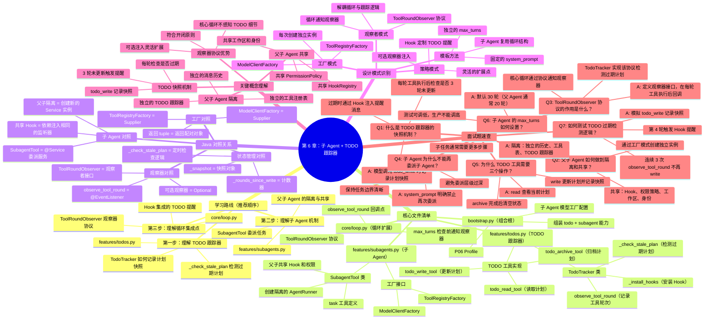

# 第 6 章学习路线图

## 使用说明

这个 Markdown 文件包含 Mermaid mindmap 格式的脑图，可以在以下环境中渲染：
- GitHub/GitLab 的 Markdown 预览
- VSCode + Mermaid 插件
- 支持 Mermaid 的在线编辑器（如 mermaid.live）

如果需要更好的交互体验，建议使用 `ch06_learning_roadmap.xmind` 文件。
