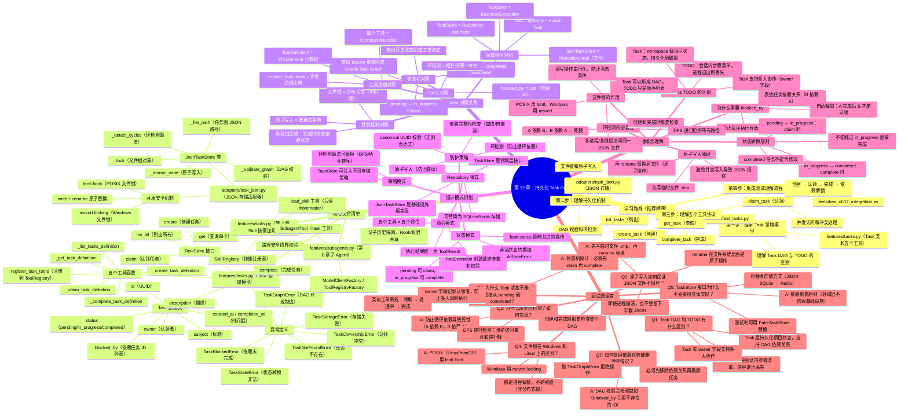

# 第 12 章：持久化 Task DAG 学习导图

```mermaid
mindmap
  root((第 12 章：持久化 Task DAG))
    学习路线（推荐顺序）
      第一步：理解 Task 领域模型
        tests/test_tasks.py
        features/tasks.py（Task 类和五个工具）
        理解 Task DAG 与 TODO 的区别
      第二步：理解持久化机制
        adapters/task_json.py（JSON 存储）
        文件锁和原子写入
        DAG 校验和环检测
      第三步：理解五个工具协议
        create_task（创建）
        list_tasks（列出）
        claim_task（认领）
        complete_task（完成）
        get_task（查询）
      第四步：集成测试理解流程
        tests/test_ch12_integration.py
        创建 → 认领 → 完成 → 依赖解锁
        并发访问和冲突处理
    
    核心文件清单
      features/tasks.py（Task 领域模型）
        Task 数据类
          id（UUID）
          subject（标题）
          description（描述）
          status（pending/in_progress/completed）
          owner（认领者）
          blocked_by（依赖任务 ID 列表）
          created_at / completed_at（时间戳）
        异常定义
          TaskNotFoundError（任务不存在）
          TaskGraphError（DAG 环或缺边）
          TaskStateError（状态转换非法）
          TaskBlockedError（依赖未完成）
          TaskOwnershipError（认领冲突）
          TaskStorageError（存储失败）
        五个工具函数
          register_task_tools（注册到 ToolRegistry）
          _create_task_definition
          _list_tasks_definition
          _claim_task_definition
          _complete_task_definition
          _get_task_definition
        TaskStore 接口
          create（创建任务）
          list_all（列出所有）
          get（查询单个）
          claim（认领任务）
          complete（完成任务）
      adapters/task_json.py（JSON 存储适配器）
        JsonTaskStore 类
          _file_path（任务图 JSON 路径）
          _lock（文件锁对象）
          _validate_graph（DAG 校验）
          _detect_cycles（环检测算法）
          _atomic_write（原子写入）
        并发安全机制
          fcntl.flock（POSIX 文件锁）
          msvcrt.locking（Windows 文件锁）
          write + rename 原子替换
      features/skills.py（第 7 章 Skill 按需加载）
        SkillRegistry（技能注册表）
        load_skill 工具（只读 frontmatter）
        路径安全边界校验
      features/subagents.py（第 6 章子 Agent）
        SubagentTool（task 工具）
        ModelClientFactory / ToolRegistryFactory
        父子历史隔离，Hook/权限共享
    
    Java 对照关系
      领域模型对照
        Task = @Entity / record Task
        TaskStore = Repository interface
        JsonTaskStore = RepositoryImpl（文件）
        TaskError = BusinessException
      状态机对照
        pending → in_progress（claim）
        in_progress → completed（complete）
        类似订单状态机或工单流转
      DAG 对照
        blocked_by = List<String>（依赖 ID）
        环检测 = 拓扑排序 / DFS
        类似 Maven 依赖图或 Gradle Task Graph
      并发控制对照
        文件锁 = 分布式锁（单机版）
        原子写入 = 数据库事务
        乐观锁思想：完成时检查依赖状态
      工具注册对照
        register_task_tools = 命令总线注册
        每个工具 = CommandHandler
        ToolDefinition = @Command 元数据
    
    设计模式识别
      Repository 模式
        TaskStore 是领域层接口
        JsonTaskStore 是基础设施层实现
        可替换为 SQLite/Redis 存储
      状态模式
        Task.status 控制允许的操作
        pending 可 claim，in_progress 可 complete
        非法状态转换抛 TaskStateError
      策略模式
        TaskStore 可注入不同存储策略
        环检测算法可替换（DFS/拓扑排序）
      命令模式
        五个工具 = 五个命令
        ToolDefinition 封装请求参数和校验
        执行结果统一为 ToolResult
      防护策略
        canonical UUID 校验（正则表达式）
        依赖完整性检查（缺边/自依赖）
        环检测（防止循环依赖）
        原子写入（防止脏读）
    
    关键概念理解
      Task vs TODO 的区别
        TODO：会话内步骤清单，进程退出即丢失
        Task：workspace 级项目状态，持久化到磁盘
        Task 可以形成 DAG，TODO 只是顺序列表
        Task 支持多人协作（owner 字段）
      为什么需要 blocked_by
        表达任务依赖关系（B 依赖 A）
        自动解锁：A 完成后 B 才能认领
        防止乱序执行导致错误
      环检测的必要性
        A 依赖 B，B 依赖 A → 死锁
        创建和完成时都要检查
        DFS 递归检测所有路径
      原子写入原理
        先写临时文件 .tmp
        再 rename 替换原文件（原子操作）
        避免并发写入导致 JSON 损坏
      文件锁的作用
        多进程/多线程访问同一 JSON 文件
        读写操作串行化，防止竞态条件
        POSIX 用 fcntl，Windows 用 msvcrt
      状态转换规则
        pending → in_progress：claim 时
        in_progress → completed：complete 时
        不能跳过 in_progress 直接完成
        completed 任务不能再修改
    
    面试题速查
      Q1: Task DAG 和 TODO 有什么区别？
        A: TODO 是会话内步骤清单，进程退出丢失
        Task 是持久化项目状态，支持 DAG 依赖关系
        Task 有 owner 字段支持多人协作
      Q2: 为什么需要环检测？如何实现？
        A: 防止循环依赖导致死锁（A 依赖 B，B 依赖 A）
        DFS 递归检测：维护访问集合和递归栈
        创建和完成时都要检查整个 DAG
      Q3: 原子写入如何保证 JSON 文件不损坏？
        A: 先写临时文件 .tmp，再 rename 替换
        rename 在文件系统层面是原子操作
        即使进程崩溃，也不会留下半截 JSON
      Q4: 文件锁在 Windows 和 Linux 上的区别？
        A: POSIX（Linux/macOS）用 fcntl.flock
        Windows 用 msvcrt.locking
        都是进程级锁，不跨机器（非分布式锁）
      Q5: TaskStore 接口为什么不直接用具体实现？
        A: 依赖倒置原则（领域层不依赖基础设施）
        可替换存储方式（JSON → SQLite → Redis）
        测试时可用 FakeTaskStore 替换
      Q6: 为什么 Task 状态不能直接从 pending 到 completed？
        A: 状态机设计：必须先 claim 再 complete
        owner 字段记录认领者，防止多人同时执行
        类似工单系统：领取 → 处理中 → 完成
      Q7: 如何处理依赖任务被删除的情况？
        A: DAG 校验会检测缺边（blocked_by 引用不存在的 ID）
        抛 TaskGraphError 拒绝操作
        必须先移除依赖关系再删除任务
```
