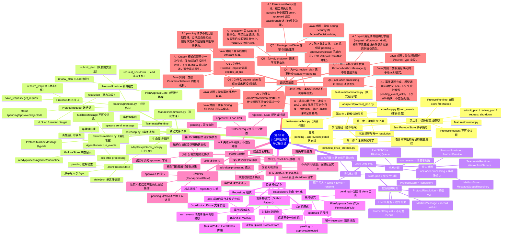

# 第 16 章：计划审批协议与优雅关机 学习导航图

## 学习脑图



## Java 开发者 3 步速通指南

### 第 1 步：从测试理解协议流程（15 分钟）

```bash
# 阅读测试文件，理解完整协议流程
cat tests/test_ch16_protocol.py

# 关注点：
# - submit_plan 如何提交计划
# - review_plan 如何审批（approved=True/False）
# - request_shutdown 如何触发关机
# - 事件如何通过 wait_event 和 acknowledge_events 消费
```

**Java 对照**：
- `submit_plan` = 创建审批单并发送消息
- `review_plan` = 审批单状态迁移
- `wait_event` = `BlockingQueue.take()`
- `acknowledge_events` = 消息确认（commit）

**核心流程**：
```
队友调用 submit_plan
  ↓
保存 pending 请求到 ProtocolStore
  ↓
投递 ProtocolMailboxMessage 到 Lead
  ↓
Lead 调用 review_plan(approved=True/False)
  ↓
状态迁移到 approved/rejected
  ↓
投递响应消息到队友
  ↓
队友收到事件继续执行
```

### 第 2 步：读协议核心代码（20 分钟）

```bash
# 按顺序阅读三个核心文件
cat features/protocol.py           # 领域模型和服务
cat adapters/protocol_json.py      # 持久化实现
cat features/mailbox.py             # 消息传递（快速浏览）

# 重点理解：
# 1. ProtocolRequest 的三个状态
# 2. ProtocolRuntime 的三个方法
# 3. PlanApprovalGate 的拦截逻辑
# 4. JsonProtocolStore 的原子写入
```

**关键理解**：

| Python 概念 | Java 对照 | 用途 |
|------------|----------|------|
| `ProtocolStore` | `Repository<ProtocolRequest>` | 持久化接口 |
| `ProtocolRuntime` | `ProtocolService` | 领域服务 |
| `ProtocolResolution` | 终态值对象（VO） | 不可变审批结果 |
| `PlanApprovalGate` | `PermissionRule` | 权限拦截器 |
| `ProtocolMailboxMessage` | 领域事件 | 类型化消息 |

### 第 3 步：理解事件消费机制（10 分钟）

```bash
# 快速浏览事件驱动部分
cat core/loop.py                    # 找 run_events 方法
cat features/teammates.py           # 找 drain_events 和 acknowledge_events

# 理解：
# - 事件如何从 Mailbox 流向 EventInbox
# - run_events 如何消费事件
# - ack-after-processing 的保证
```

**不要深入细节**：这些是基础设施层，知道协议如何通过事件传递即可。

---

## 调试断点速查（VSCode/PyCharm 适用）

### 【必打断点】理解协议流程（5 个）

**[1] protocol.py:submit_plan 方法开始**
```python
# 观察：sender（队友名）、content（计划内容）
# 目的：确认队友提交了什么计划
```

**[2] protocol_json.py:save_request 原子写入前**
```python
# 观察：request.status（应该是 pending）、expires_at_utc
# 目的：确认请求正确保存
```

**[3] protocol.py:review_plan 方法开始**
```python
# 观察：request_id、approved（True/False）
# 目的：确认 Lead 做出了什么决策
```

**[4] protocol_json.py:resolve_request 状态迁移**
```python
# 观察：resolution.approved、resolution.content
# 目的：确认状态正确迁移到终态
```

**[5] loop.py:run_events 方法开始**
```python
# 观察：next_event.event_id、event.prompt
# 目的：确认队友收到了响应事件
```

### 【可选断点】深入理解（3 个）

**[6] protocol.py:PlanApprovalGate.evaluate**
```python
# 观察：request.status、决策结果（deny/passthrough）
# 目的：理解计划门控如何拦截工具
```

**[7] mailbox_json.py:post 方法**
```python
# 观察：消息如何写入 ready 目录
# 目的：理解 Mailbox 的四态迁移
```

**[8] teammates.py:acknowledge_events**
```python
# 观察：事件如何从 processing 移到 done
# 目的：理解 ack-after-processing 语义
```

---

## 核心概念速记

**协议状态机**：pending（等待） → approved（批准） / rejected（拒绝）

**Outbox 模式**：先保存请求，再投递消息（保证至少一次传递）

**ack-after-processing**：处理完才确认，ack 失败只补确认（防止消息丢失）

**计划门控**：pending 计划自动 deny 工具调用（approved 后放行）

**优雅关机**：Lead 发送 shutdown → 队友确认 → 不再调用模型

---

## 核心类比速查表

| Python 概念 | Java 对照 | 用途 |
|------------|----------|------|
| `ProtocolRequest` | 不可变 record | 协议请求快照 |
| `ProtocolStore` | `Repository<T>` | 持久化接口 |
| `ProtocolRuntime` | 领域 Service | 协议编排服务 |
| `MailboxMessage` | 领域事件 | 消息传递 DTO |
| `EventInbox` | `BlockingQueue<Event>` | 事件队列 |
| `run_events()` | 消费者线程 | 事件驱动循环 |
| `PlanApprovalGate` | `PermissionRule` | 权限拦截器 |
| `ProtocolResolution` | 终态值对象 | 不可变审批结果 |

---

## 学完本章你会理解

✅ **结构化协议的必要性**：为什么需要明确状态机代替自然语言  
✅ **Outbox 模式**：如何保证协议请求至少一次传递  
✅ **ack-after-processing 语义**：如何防止事件消息丢失  
✅ **计划门控机制**：如何用权限规则拦截未审批的危险操作  
✅ **优雅关机流程**：Lead 如何安全停止队友进程  
✅ **状态机唯一终态**：为什么 resolution 只能设置一次  

---

## 常见问题 FAQ

### Q1: 为什么需要 expires_at_utc？
**A**: pending 请求不能无限期等待。Lead 可能忘记审批或进程崩溃，过期后自动拒绝避免队友永久阻塞。类似 CompletableFuture 的超时机制。

### Q2: 为什么 submit_plan 先保存再投递消息？
**A**: Outbox 模式保证至少一次传递。保存成功但投递失败时，可以重试投递而不会丢失请求。类似事务性发件箱表。

### Q3: 为什么 review_plan 需要检查 status == pending？
**A**: 防止重复审批。状态机保证 pending → approved/rejected 是单向的，已终态请求不能再次审批，类似订单状态机的幂等检查。

### Q4: ack 失败后如何保证不重复处理？
**A**: ack 失败时事件身份保存到 `_pending_event_acks`，下次 run_events 只补 ack，不重新调用模型。history 和模型调用已完成，只是确认失败。

### Q5: PlanApprovalGate 返回 passthrough 是什么意思？
**A**: passthrough 表示"我不做决策，交给其他规则"。approved 计划不应被门控拒绝，但仍需其他权限规则（如沙箱检查）评估。

---

## 下一步学习建议

1. **运行测试**：`pytest tests/test_ch16_protocol.py -v`
2. **修改过期时间**：改成 1 秒，观察 pending 请求自动拒绝
3. **实现 FakeProtocolStore**：练习 Repository 接口的内存实现
4. **追踪消息流转**：在 mailbox ready/processing/done 目录观察文件迁移

---

## 文件依赖关系图

```
ProtocolRuntime (protocol.py)
    ├── depends on → ProtocolStore (protocol.py 接口)
    │   └── implemented by → JsonProtocolStore (protocol_json.py)
    ├── depends on → TeammateRuntime (teammates.py)
    │   ├── depends on → MailboxStore (mailbox.py 接口)
    │   │   └── implemented by → FileMailboxStore (mailbox_json.py)
    │   └── depends on → EventInbox (events.py)
    └── provides → PlanApprovalGate (PermissionRule)

AgentRunner (loop.py)
    └── run_events() → 消费 EventInbox 中的协议事件
```

---

## 总结：协议系统的三个核心职责

1. **状态管理**：维护 pending → approved/rejected 状态机
2. **消息传递**：通过 Mailbox 和 EventInbox 传递结构化协议消息
3. **权限拦截**：PlanApprovalGate 防止队友绕过审批执行危险操作

**记住**：结构化协议不是为了限制队友，而是为了让 Lead 和队友有明确的协作契约，避免自然语言理解歧义导致的错误执行。
