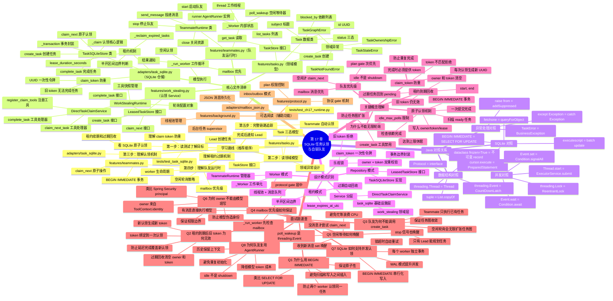

# 第 17 章：SQLite 任务认领与自驱队友 学习导航图

## 学习脑图



## Java 开发者 3 步速通指南

### 第 1 步：从测试看目标（15 分钟）
```bash
# 阅读 SQLite 认领测试
cat tests/test_task_sqlite.py

# 关注点：
# - claim_next 如何返回 TaskClaim
# - lease 到期后任务如何回到 pending
# - 旧 claim_token 为何被拒绝
# - 多个 worker 如何避免认领同一任务

# 阅读队友运行时测试
cat tests/test_ch17_runtime.py

# 关注点：
# - Lead 如何创建任务 DAG
# - Teammate 如何自动认领
# - 完成后如何通知 Lead
# - 空闲轮询如何触发
```

**Java 对照**：这像先读 `TaskRepositoryTest` 和 `WorkerServiceTest`，理解业务契约。

### 第 2 步：读核心认领逻辑（20 分钟）
```bash
# 阅读 SQLite 仓储实现
cat adapters/task_sqlite.py

# 阅读顺序：
# 1. TaskSQLiteStore.__init__ 表结构
# 2. claim_next 认领入口
# 3. _transaction 事务封装
# 4. _claim 认领核心逻辑
# 5. complete_task 完成逻辑

# 阅读认领 Service
cat features/work_stealing.py

# 关注点：
# - DirectTaskClaimService 如何注册工具
# - claim_next_task 工具如何调用仓储
# - owner 如何从 ToolContext.identity 获取
```

**关键理解**：
- `BEGIN IMMEDIATE` = Java 的 `SELECT FOR UPDATE`
- `claim_token` = 乐观锁版本号
- `lease_expires_at_utc` = 租约到期时间
- `executescript` = batch SQL 执行

### 第 3 步：理解队友运行时（10 分钟）
```bash
# 阅读队友运行时
cat features/teammates.py

# 阅读顺序：
# 1. TeammateRuntime.__init__ 依赖注入
# 2. start 启动队友线程
# 3. _run_worker 工作循环
# 4. send_message 消息投递
# 5. stop 停止逻辑

# 关注点：
# - mailbox 优先级如何实现
# - poll_wakeup 如何唤醒空闲线程
# - 为何复用 AgentRunner 而非每次创建
```

**不要深入细节**：mailbox_json、protocol、background 是辅助功能，先跳过。

---

## 调试断点速查（VSCode/PyCharm 适用）

如果你想单步调试理解流程，按优先级打以下断点：

### 【必打断点】理解 SQLite 认领（5 个）
[1] task_sqlite.py:XXX  → claim_next() 入口
    观察：当前 identity、lease_duration_seconds
    目的：确认认领参数

[2] task_sqlite.py:XXX  → _transaction() 开始事务
    观察：BEGIN IMMEDIATE 语句
    目的：理解事务隔离

[3] task_sqlite.py:XXX  → _claim() 扫描 ready 任务
    观察：SQL WHERE 条件、ORDER BY
    目的：看如何筛选可认领任务

[4] task_sqlite.py:XXX  → UPDATE tasks 写入 owner/token
    观察：claim_token UUID、lease_expires_at_utc
    目的：确认认领写入内容

[5] task_sqlite.py:XXX  → complete_task() 校验 owner/token
    观察：当前 owner、claim_token 是否匹配
    目的：理解权限校验

### 【必打断点】理解队友运行时（3 个）
[6] teammates.py:XXX  → _run_worker() 循环开始
    观察：当前 worker 状态、mailbox 是否有消息
    目的：理解优先级顺序

[7] teammates.py:XXX  → mailbox 消息处理分支
    观察：消息内容、是否调用模型
    目的：看 mailbox 优先如何实现

[8] teammates.py:XXX  → claim_next 空闲认领分支
    观察：idle_polls 计数、是否达到上限
    目的：理解空闲轮询策略

一次完整认领的调用链：
[6] → [1] → [2] → [3] → [4] → [7] → [5]

### 【可选断点】深入理解（2 个）
[9] task_sqlite.py:XXX  → _reclaim_expired_tasks() 租约回收
    观察：哪些任务过期、如何清空 owner/token
    目的：理解租约到期机制

[10] teammates.py:XXX  → poll_wakeup.wait() 空闲等待
    观察：timeout 参数、唤醒原因
    目的：理解等待器唤醒逻辑

---

## 核心概念速记

**原子认领机制** = BEGIN IMMEDIATE { 扫描 ready → 检查依赖 → 写入 owner/token/lease } COMMIT

**租约到期回收** = 半开区间 [start, end) 到期后清空 owner/token，旧 token 仍无效

**claim_token 防重** = UUID 一次性令牌，完成时必须匹配当前有效 token

**队友优先级** = mailbox 优先 → protocol gate → 空闲 claim_next → idle 休眠

**为何禁止 create_task** = 防止空闲轮询无限扩张任务图，保证收敛

---

## 核心类比速查表

| Python 概念 | Java 对照 | 用途 |
|------------|----------|------|
| `LeasedTaskStore` | `Repository<Task>` | 仓储接口 |
| `BEGIN IMMEDIATE` | `SELECT FOR UPDATE` | 悲观锁 |
| `claim_token` | 乐观锁版本号 | 防重 |
| `threading.Event` | `CountDownLatch` | 线程等待 |
| `threading.Lock` | `ReentrantLock` | 互斥锁 |
| `executescript` | batch update | 批量 SQL |
| `cursor.fetchone` | `queryForObject` | 查询单行 |
| `TeammateRuntime` | `WorkerService` | 工作者管理 |

---

## 学完本章你会理解

✅ **SQLite 原子认领**：BEGIN IMMEDIATE 事务保证原子性  
✅ **租约到期回收**：半开区间边界 + 过期清空 owner/token  
✅ **claim_token 防重**：一次性令牌防止重复完成  
✅ **队友优先级**：mailbox 优先 → protocol gate → 空闲认领  
✅ **空闲轮询策略**：idle_max_polls 限制 + poll_wakeup 唤醒  
✅ **owner 身份绑定**：ToolContext.identity 不可伪造  
✅ **工具权限隔离**：Lead 五工具 vs Teammate 四工具  

---

## 常见问题 FAQ

### Q1: 为什么用 BEGIN IMMEDIATE 而非 BEGIN DEFERRED？
**A**: BEGIN IMMEDIATE 立即获取写锁，防止扫描 ready 任务和写入 owner 之间被其他事务插入。如果用 DEFERRED，两个 worker 可能同时扫描到同一个 ready 任务，导致重复认领。类比 Java 的 SELECT FOR UPDATE。

### Q2: 租约到期后为何旧 claim_token 仍无效？
**A**: claim_token 绑定到一次认领。过期回收时清空 owner 和 token，新认领生成新 token。如果允许旧 token 完成，会覆盖新 worker 的进度。类比 JWT 过期后不能续期，只能重新登录。

### Q3: 队友为何不能调用 create_task 工具？
**A**: 空闲轮询会让队友不断认领新任务。如果队友能创建任务，会无限扩张任务图，永远不会 idle。只有 Lead 能规划任务，Teammate 只执行已有任务，保证任务图收敛。

### Q4: mailbox 优先级如何实现？
**A**: `_run_worker` 循环先检查 mailbox，有消息直接处理。没消息才检查 protocol gate，最后才尝试 claim_next。这是代码顺序保证的，不是配置项。

### Q5: 空闲等待如何唤醒？
**A**: `poll_wakeup` 是 `threading.Event`，收到新消息时调用 `set()` 唤醒。stop 信号也会唤醒。避免忙等（busy waiting）浪费 CPU。类比 Java 的 `Condition.await()` + `signalAll()`。

### Q6: 为何 owner 不能由模型填写？
**A**: owner 来自 `ToolContext.identity`，是框架注入的可信身份。如果让模型填写 owner 参数，模型可能伪造身份，绕过权限检查。类比 Spring Security 的 `@AuthenticationPrincipal`，不能由请求体提供。

### Q7: SQLite 如何支持多个 worker 并发认领？
**A**: BEGIN IMMEDIATE 串行化写入，每个 worker 独立事务。SQLite 的 WAL 模式允许多读并发。认领失败时可以重试下一个 ready 任务。类比数据库连接池 + 乐观锁重试。

### Q8: 为何队友复用 AgentRunner 而非每次创建？
**A**: 历史保留上下文，模型能记住之前的对话。避免重复初始化工具注册表。降低模型 token 成本（system prompt 只发一次）。idle 是"空闲等待"，不是"关闭销毁"。

---

## 下一步学习建议

1. **动手运行测试**：`pytest tests/test_task_sqlite.py tests/test_ch17_runtime.py -v`
2. **修改租约时长**：改成 3 秒，观察过期回收
3. **增加队友数量**：启动 3 个 teammate，观察并发认领
4. **实现自定义 LeasedTaskStore**：用 Redis 或 Postgres 替换 SQLite

---

## 文件依赖关系图

```
TeammateRuntime (teammates.py)
    ├── depends on → MailboxStore (mailbox.py)
    ├── depends on → EventInbox (events.py)
    ├── depends on → JobSupervisor (background.py)
    └── depends on → WorkStealingRuntime (work_stealing.py)
        └── depends on → LeasedTaskStore (work_stealing.py Protocol)
            └── implemented by → TaskSQLiteStore (task_sqlite.py)

DirectTaskClaimService (work_stealing.py)
    ├── depends on → LeasedTaskStore (work_stealing.py Protocol)
    └── depends on → ToolContext (tools.py)

AgentRunner (loop.py)
    ├── depends on → ModelClient (model.py)
    ├── depends on → ToolRegistry (tools.py)
    └── depends on → RuntimeEventPump (loop.py Protocol)
        └── implemented by → BackgroundEventPump (background.py)
```

---

## 总结：第 17 章的三个核心职责

1. **原子认领**：SQLite 事务保证扫描、检查、写入的原子性
2. **租约管理**：半开区间边界 + 过期回收 + token 防重
3. **队友编排**：mailbox 优先 + 空闲轮询 + 结果通知 Lead

**记住**：`TeammateRuntime` 是编排者，`TaskSQLiteStore` 是存储层，`DirectTaskClaimService` 是领域层。队友不能创建任务，只能执行已有任务，保证任务图收敛。
