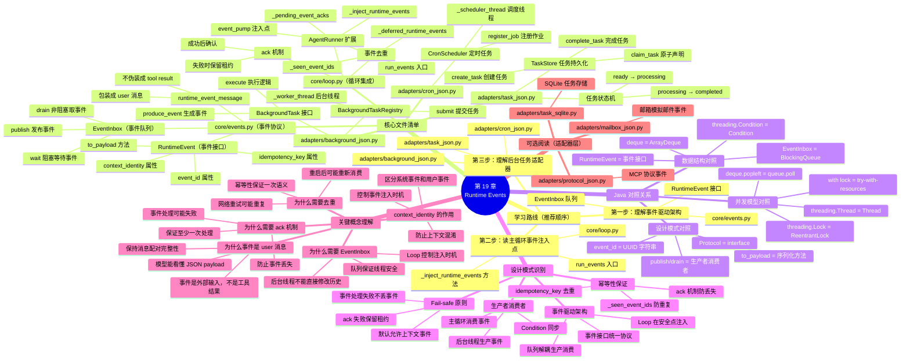

# 第 19 章：运行时事件与后台任务学习导航图

## 学习脑图



## Java 开发者 3 步速通指南

### 第 1 步：理解事件协议（10 分钟）
```bash
# 阅读事件接口和队列实现
cat core/events.py

# 关注点：
# - RuntimeEvent 接口定义（类似 Java interface）
# - EventInbox 队列实现（类似 BlockingQueue）
# - runtime_event_message 包装函数
```

**Java 对照**：
- `RuntimeEvent` = `interface Event { String getEventId(); Map<String, Object> toPayload(); }`
- `EventInbox` = `BlockingQueue<RuntimeEvent>` + `Condition`
- `deque` = `ArrayDeque`（双端队列）

### 第 2 步：读主循环集成点（20 分钟）
```bash
# 阅读 Loop 如何注入事件
cat core/loop.py

# 重点阅读：
# 1. run_events() 入口（行 256-296）
# 2. _inject_runtime_events() 注入逻辑（行 518-536）
# 3. _pending_event_acks 重试机制（行 231、258-262）
```

**关键理解**：
- 事件在两个安全点注入：循环开始前、模型返回文本后
- 事件包装成普通 `user` 消息，不伪装成 `tool` 消息
- ack 失败时保留租约，下次只重试确认不重复处理

### 第 3 步：理解后台任务适配器（15 分钟）
```bash
# 浏览后台任务实现
cat adapters/background_json.py  # 后台任务注册表
cat adapters/task_json.py        # 任务持久化存储
cat adapters/cron_json.py         # 定时任务调度器
```

**不要深入细节**：这些是具体实现，先理解架构即可。

---

## 核心类比速查表

| Python 概念 | Java 对照 | 用途 |
|------------|----------|------|
| `RuntimeEvent` | `interface Event` | 事件协议 |
| `EventInbox` | `BlockingQueue<Event>` | 线程安全队列 |
| `deque` | `ArrayDeque` | 双端队列 |
| `threading.Condition` | `Condition` | 条件变量 |
| `threading.Thread` | `Thread` | 后台线程 |
| `with lock:` | `try (lock) { }` | 自动释放锁 |
| `event_id` | UUID 字符串 | 事件唯一标识 |
| `idempotency_key` | 幂等键 | 去重标识 |

---

## 学完本章你会理解

✅ **事件驱动架构**：后台线程通过队列发布事件，主循环消费事件  
✅ **生产者消费者模式**：EventInbox 解耦事件生产和消费  
✅ **幂等性保证**：通过 event_id 去重，防止重复处理  
✅ **ack 机制**：事件处理成功后确认，失败时保留租约  
✅ **为什么事件是 user 消息**：保持消息配对完整性  
✅ **context_identity 的作用**：区分系统事件和用户上下文事件  

---

## 常见问题 FAQ

### Q1: 为什么事件要包装成 user 消息，而不是 tool 消息？
**A**: 因为事件是外部输入（后台任务完成、定时器触发），不是 Agent 主动调用工具的结果。如果伪装成 tool 消息，会破坏消息配对契约（每个 tool_call 必须有对应 tool 结果）。

### Q2: 为什么需要 EventInbox，不能直接修改历史？
**A**: 因为后台线程和主循环是并发执行的，直接修改历史会导致线程安全问题。EventInbox 是线程安全的队列，保证事件按 FIFO 顺序注入。

### Q3: 为什么需要 ack 机制？
**A**: 因为事件处理可能失败（模型调用失败、网络中断）。ack 机制保证事件至少被处理一次：处理成功后确认，失败时保留租约等待重试。

### Q4: _seen_event_ids 在做什么？
**A**: 去重。重启后可能重新消费未 ack 的事件，或者网络重试导致事件重复。通过 event_id 去重保证每个事件只处理一次（幂等性）。

### Q5: context_identity 的作用是什么？
**A**: 区分系统事件（如定时任务）和用户上下文事件（如邮箱回复）。系统事件可以随时注入，但用户上下文事件只能在处理该用户的运行时事件回合中注入，避免上下文混淆。

### Q6: 为什么 _inject_runtime_events 有两个调用点？
**A**: 
1. 循环开始前（行 341）：注入上一轮积累的事件
2. 模型返回文本后（行 389-393）：如果有待处理事件，继续循环而不是直接返回

这保证事件在安全点注入，不会破坏消息配对。

### Q7: _pending_event_acks 是什么？
**A**: ack 失败的事件缓存。历史已更新、模型已调用，但 ack 失败时，不能重新处理事件（会重复），只需下次重试 ack。

---

## 下一步学习建议

1. **阅读测试**：`tests/test_events.py`，理解事件队列的使用
2. **实现一个简单事件**：定义 `dataclass` 实现 `RuntimeEvent` 接口
3. **调试事件注入**：在 `_inject_runtime_events` 打断点，观察事件如何变成消息
4. **阅读后台任务**：看 `BackgroundTaskRegistry` 如何在工作线程中发布事件

---

## 文件依赖关系图

```
AgentRunner (loop.py)
    ├── depends on → RuntimeEventPump (loop.py Protocol)
    │   └── implemented by → EventInbox (events.py)
    ├── depends on → RuntimeEvent (events.py Protocol)
    └── calls → runtime_event_message (events.py)

BackgroundTaskRegistry (background_json.py)
    ├── depends on → EventInbox (events.py)
    ├── depends on → BackgroundTask (background_json.py Protocol)
    └── runs → worker_thread (background_json.py)

TaskStore (task_json.py)
    ├── creates → Task (task_json.py dataclass)
    └── manages → ready/processing/completed states

CronScheduler (cron_json.py)
    ├── depends on → EventInbox (events.py)
    └── runs → scheduler_thread (cron_json.py)
```

---

## 面试速查

### 面试题 1：为什么后台任务不能直接修改 Agent 历史？
**答案要点**：
1. **线程安全**：历史是可变列表，并发修改会导致竞态条件
2. **消息配对**：直接插入可能破坏 tool_call 和 tool 消息的配对契约
3. **时序控制**：Loop 需要控制事件注入时机，确保在安全点（validate_tool_pairing 通过后）

### 面试题 2：EventInbox 的 drain 和 wait 有什么区别？
**答案要点**：
1. **drain**：非阻塞，立即返回当前队列中的事件（可能为空）
2. **wait**：阻塞等待，直到至少有一条事件或超时
3. **使用场景**：drain 用于轮询，wait 用于等待待处理工作

### 面试题 3：如何保证事件的幂等性？
**答案要点**：
1. **event_id 去重**：每个事件有唯一 ID，_seen_event_ids 记录已处理事件
2. **idempotency_key**：业务级幂等键，防止重复提交（如邮件 message_id）
3. **ack 机制**：处理成功后确认，失败时保留租约等待重试

### 面试题 4：为什么 ack 失败时要保留租约？
**答案要点**：
1. **防止重复处理**：历史已更新、模型已调用，不能重新处理
2. **保证一致性**：下次只重试 ack，不重复调用模型
3. **避免事件丢失**：release 会让事件重新进入 ready 状态，导致重复消费

### 面试题 5：context_identity 为什么影响事件注入时机？
**答案要点**：
1. **系统事件**：`context_identity=None`，可以随时注入
2. **用户上下文事件**：`context_identity="user123"`，只能在该用户的运行时事件回合中注入
3. **防止混淆**：避免 Alice 的邮件回复注入到 Bob 的会话中

### 面试题 6：RuntimeEvent 为什么需要 to_payload 方法？
**答案要点**：
1. **序列化**：事件需要持久化到 JSON 文件或数据库
2. **模型可读**：包装成 user 消息后，payload 让模型理解事件内容
3. **类型安全**：返回 `Mapping[str, object]` 保证只包含 JSON 基础类型

### 面试题 7：为什么 EventInbox 用 deque 而不是 list？
**答案要点**：
1. **O(1) 复杂度**：`deque.popleft()` 是 O(1)，`list.pop(0)` 是 O(n)
2. **FIFO 语义**：双端队列天然支持队列操作
3. **线程安全**：配合 `threading.Condition` 实现阻塞等待

### 面试题 8：如何实现一个自定义事件？
**答案要点**：
```python
from dataclasses import dataclass

@dataclass(frozen=True)
class CustomEvent:
    event_id: str
    context_identity: str | None
    idempotency_key: str | None
    data: str
    
    def to_payload(self) -> dict[str, object]:
        return {
            "type": "custom_event",
            "data": self.data,
        }
```

---

## 总结：运行时事件的三个核心职责

1. **解耦后台和主循环**：通过事件队列实现生产者消费者模式
2. **保证线程安全**：后台线程不直接修改历史，只发布事件
3. **维护幂等性**：通过 event_id 去重和 ack 机制保证至少一次、最多一次语义

**记住**：`RuntimeEvent` 是协议，`EventInbox` 是队列，`AgentRunner` 在安全点消费事件。事件永远包装成 `user` 消息，不伪装成 `tool` 结果。
